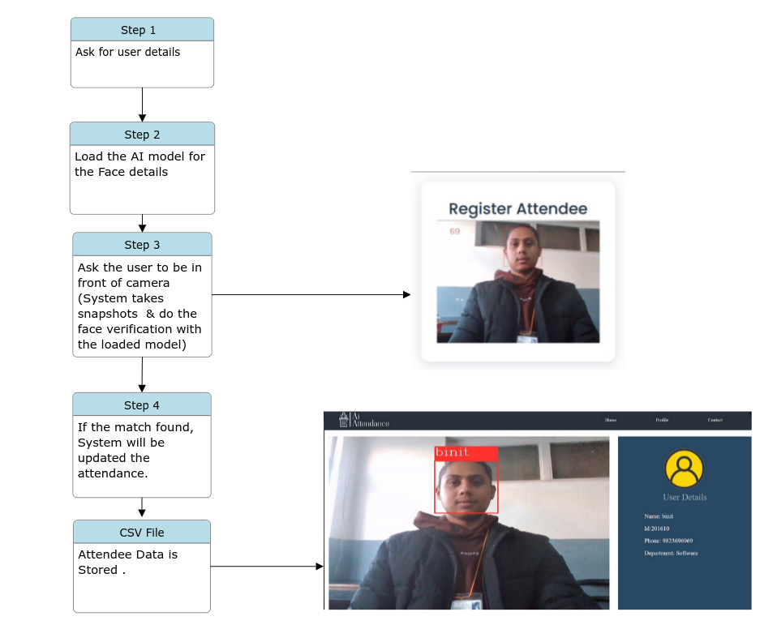

# Attendence System with Face Recognition
# Introduction
Attendance Management is a crucial aspect of keeping track of employee or student attendance details. It involves documenting the time employees or students spend working or taking time off. In the current digital era, face recognition systems have become indispensable in various sectors. Face recognition, a widely-used biometric technology, serves purposes such as security, authentication, and identification.

This project introduces an artificial intelligence-based attendance management system with face recognition technology. The primary objective is to update attendance records using employees' facial features through computer vision.

### Installation
__Note__: This project uses the Flask framework written in Python. So you need a python interpreter on your system.
### For Linux/MacOS/Windows:
+ Clone the repo:
    git clone https://github.com/DangolSrijit/AI_attendance
+ Make a virtual environment inside server dir. Eg:
    python -m venv venv
+ Activate the virtual environment. Eg:
    source ./venv/bin/activate
+ Install the dependencies from the repo's requirements.txt file. pip install -r requirements.txt
+ Run the following code: python train.py to train
+ Run the python login.py
+ Go to the url localhost:5000 on your browser.

# Technologies & Frameworks
### Attendance Receiver - Face Scanner (Python)
+ Python 3.11.4 - Main programming language.
+ OpenCV - for computer vision.
+ Haar cascade face detection - K-Nearest Neighbors (KNN) Algorithm for face recoggnition.
+ Pickle module - store trained data as pickle file.

### Objective
+ Automated Attendance Tracking
+ User-Friendly Management Module
+ Real-Time Updates
+ Adaptability to Different Environments

